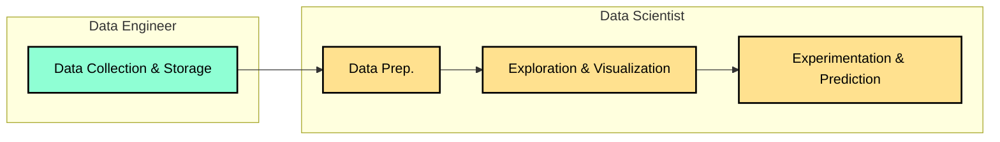

#### * Refering to the Data Workflow:

#### * Comparison of Tasks:

| Data Engineer            | Data Scientist             |
| --- | --- |
| * Ingest data            | * Exploit data             |
| * Set up DBs             | * Access DBs               |
| * Build data pipelines   | * Use pipeline outputs     |
| * Strong SW Skills       | * Strong Analytical Skills |

